# PerfMirror - Performance Tracking for Engineers

A modern web application for tracking engineering performance using the **IOOI Framework** (Input, Output, Outcome, Impact) with role-based weighted scoring. Built with Next.js 14, TypeScript, and intelligent database switching between local SQLite and cloud Turso.

[](https://perf-mirror-rdbf.vercel.app/)
[](#quick-start)

## 🏗️ Architecture

The application features a hybrid architecture that automatically switches between local SQLite (development) and cloud Turso database (production):

```mermaid
graph TB
    subgraph "Frontend Layer"
        UI["Next.js 14 React App<br/>TypeScript + Tailwind CSS"]
        COMP["React Components<br/>• Dashboard<br/>• Categories<br/>• WeeklyLogs<br/>• Targets<br/>• RoleWeights"]
    end
    
    subgraph "API Layer"
        API["Next.js API Routes"]
        ROUTES["API Endpoints<br/>• /api/categories<br/>• /api/weekly-logs<br/>• /api/targets<br/>• /api/role-weights"]
    end
    
    subgraph "Data Layer"
        PRISMA["Hybrid Prisma Client<br/>Smart Database Switching"]
        TURSO["Turso HTTP Client<br/>Production Cloud DB"]
        SQLITE["SQLite Local<br/>Development DB"]
    end
    
    subgraph "Core Logic"
        CALC["Score Calculation Engine<br/>• Weighted Scoring<br/>• IOOI Framework<br/>• Performance Insights"]
        UTILS["Utility Functions<br/>• Date Handling<br/>• Validation<br/>• Formatting"]
    end
    
    subgraph "Database Schema"
        CAT["Category<br/>• name<br/>• dimension (IOOI)<br/>• scorePerOccurrence"]
        WL["WeeklyLog<br/>• week<br/>• categoryId<br/>• count<br/>• overrideScore"]
        PT["PerformanceTarget<br/>• thresholds<br/>• timePeriodWeeks<br/>• isActive"]
        RW["RoleWeights<br/>• inputWeight<br/>• outputWeight<br/>• outcomeWeight<br/>• impactWeight"]
    end
    
    subgraph "IOOI Framework"
        INPUT["Input (I)<br/>Activities you consume<br/>• Code Reviews<br/>• Meetings<br/>• Training"]
        OUTPUT["Output (O)<br/>Work you produce<br/>• Features<br/>• Bug Fixes<br/>• Documentation"]
        OUTCOME["Outcome (O)<br/>Results you achieve<br/>• Designs<br/>• Proposals<br/>• Decisions"]
        IMPACT["Impact (I)<br/>Influence you create<br/>• Mentoring<br/>• Hiring<br/>• Culture"]
    end
    
    subgraph "Environment"
        DEV["Development<br/>SQLite + Prisma"]
        PROD["Production<br/>Turso + Vercel"]
    end
    
    UI --> API
    COMP --> UI
    API --> ROUTES
    ROUTES --> PRISMA
    PRISMA --> TURSO
    PRISMA --> SQLITE
    ROUTES --> CALC
    CALC --> UTILS
    
    PRISMA --> CAT
    PRISMA --> WL  
    PRISMA --> PT
    PRISMA --> RW
    
    CALC --> INPUT
    CALC --> OUTPUT
    CALC --> OUTCOME
    CALC --> IMPACT
    
    DEV --> SQLITE
    PROD --> TURSO
    
    style UI fill:#e1f5fe
    style API fill:#f3e5f5
    style PRISMA fill:#e8f5e8
    style CALC fill:#fff3e0
    style INPUT fill:#ffebee
    style OUTPUT fill:#e3f2fd
    style OUTCOME fill:#f1f8e9
    style IMPACT fill:#fce4ec
```



## ✨ Key Features

- **📊 IOOI Framework**: Structured performance tracking across Input, Output, Outcome, and Impact dimensions
- **⚖️ Role-Based Scoring**: Customizable weights for Engineer, Manager, Senior Manager, Director roles
- **📈 Smart Insights**: AI-powered pattern detection with actionable recommendations
- **🎯 Performance Targets**: Configurable thresholds with visual progress tracking
- **📱 Modern UI**: Responsive design with interactive charts and real-time calculations
- **🔄 Hybrid Database**: Seamless switching between SQLite (local) and Turso (production)
- **🚀 Production Ready**: Deployed on Vercel with automatic builds and health monitoring

## 🚀 Quick Start

### Option 1: Using Make (Recommended)

```bash
# Complete setup and start development
make setup
make dev

# Or quick start with Docker
make quick-start
```

### Option 2: Manual Setup

```bash
# Install dependencies
npm install

# Set up database
npm run db:push

# Start development server
npm run dev

# Open application
open http://localhost:3000
```

## 🎯 Performance Levels

| Level | Weekly Points | Description |
|-------|---------------|-------------|
| **🌟 Excellent** | 225+ | Exceeding expectations across all dimensions |
| **✅ Good** | 170+ | Meeting expectations with solid performance |
| **⚠️ Needs Improvement** | 120+ | Below expectations, requires attention |
| **❌ Unsatisfactory** | <120 | Significant performance concerns |

## 📚 Documentation

### Core Documentation
- **[Performance Logic](docs/PERFORMANCE_LOGIC.md)** - Understanding the IOOI framework and scoring system
- **[Getting Started Guide](docs/GETTING_STARTED.md)** - Step-by-step setup and first-time usage
- **[API Reference](docs/API_REFERENCE.md)** - Complete API endpoints documentation
- **[Database Schema](docs/DATABASE_SCHEMA.md)** - Data models and relationships

### Development & Deployment
- **[Development Guide](docs/DEVELOPMENT.md)** - Local development setup and workflows  
- **[Docker Deployment](docs/DOCKER.md)** - Containerization and deployment options
- **[Production Setup](docs/PRODUCTION.md)** - Production deployment and monitoring
- **[Troubleshooting](docs/TROUBLESHOOTING.md)** - Common issues and solutions

### Advanced Topics
- **[Customization Guide](docs/CUSTOMIZATION.md)** - Adapting the system for your team
- **[Architecture Deep Dive](docs/ARCHITECTURE.md)** - Technical implementation details
- **[Contributing](docs/CONTRIBUTING.md)** - Development practices and contribution guidelines

## 🛠️ Technology Stack

| Category | Technology | Purpose |
|----------|------------|---------|
| **Frontend** | Next.js 14, React, TypeScript | Modern React framework with type safety |
| **Styling** | Tailwind CSS | Utility-first CSS framework |
| **Database** | SQLite + Turso | Local development + cloud production |
| **ORM** | Prisma | Type-safe database access |
| **Charts** | Recharts | Interactive data visualization |
| **Deployment** | Vercel | Serverless hosting with automatic builds |

## 📊 Quick Example

```typescript
// Weekly performance calculation
const weeklyScore = calculateWeightedScore({
  input: 45,      // Code reviews, meetings
  output: 85,     // Features, bug fixes  
  outcome: 60,    // Design docs, proposals
  impact: 30      // Mentoring, hiring
}, roleWeights.manager); // 20%, 40%, 30%, 10%

// Result: 67.5 weighted points
```

## 🔗 Related Resources

### Blog Posts & Methodology
- **[The IOOI Framework Explained](https://blog.vardan.dev/iooi-framework)** - Deep dive into Input, Output, Outcome, Impact methodology
- **[Engineering Performance Metrics That Matter](https://blog.vardan.dev/performance-metrics)** - Why traditional metrics fall short
- **[Building a Data-Driven Performance Culture](https://blog.vardan.dev/performance-culture)** - Implementation strategies for teams

### Open Source & Community
- **[GitHub Repository](https://github.com/yourusername/perf-mirror)** - Source code and issue tracking
- **[Discussions](https://github.com/yourusername/perf-mirror/discussions)** - Community questions and ideas
- **[Roadmap](https://github.com/yourusername/perf-mirror/projects)** - Planned features and improvements

## 🤝 Contributing

We welcome contributions! Please see our [Contributing Guide](docs/CONTRIBUTING.md) for:
- Development setup
- Coding standards  
- Pull request process
- Issue reporting

## 📄 License

MIT License - see [LICENSE](LICENSE) for details.

---

**Built with ❤️ for engineering teams who believe in data-driven performance tracking.** 