# PerfMirror - Performance Tracking for Engineers

A modern web application for tracking engineering performance using the **IOOI Framework** (Input, Output, Outcome, Impact) with role-based weighted scoring and comprehensive performance evaluation bands. Built with Next.js 14, TypeScript, and intelligent database switching between local SQLite and cloud Turso.

[](https://perf-mirror-rdbf.vercel.app/)
[](#quick-start)

## ✨ Key Features

- **📊 IOOI Framework**: Structured performance tracking across Input, Output, Outcome, and Impact dimensions
- **⚖️ Role-Based Scoring**: Customizable weights for Engineer, Manager, Senior Manager, Director roles
- **🎯 5-Band Performance Evaluation**: Outstanding, Strong Performance, Meeting Expectations, Partially Meeting Expectations, Underperforming
- **📋 Role-Level Performance Targets**: Configurable targets specific to role and level combinations
- **📝 Level Expectations Management**: Define and edit expectations for each role and level
- **📈 Smart Insights**: AI-powered pattern detection with actionable recommendations
- **🔄 Real-Time Data Refresh**: Seamless data updates when switching between tabs
- **📱 Modern UI**: Responsive design with interactive charts and real-time calculations
- **🌐 Hybrid Database**: Seamless switching between SQLite (local) and Turso (production)
- **🐳 Docker Ready**: Complete containerization with Make commands for easy deployment
- **🚀 Production Ready**: Deployed on Vercel with automatic builds and health monitoring

## 🏗️ Architecture

The application features a hybrid architecture that automatically switches between local SQLite (development) and cloud Turso database (production):

```mermaid
graph TB
    subgraph "Frontend Layer"
        UI["Next.js 14 React App<br/>TypeScript + Tailwind CSS"]
        COMP["React Components<br/>• Dashboard<br/>• Categories<br/>• WeeklyLogs<br/>• Targets<br/>• RoleWeights"]
    end
    
    subgraph "API Layer"
        API["Next.js API Routes"]
        ROUTES["API Endpoints<br/>• /api/categories<br/>• /api/weekly-logs<br/>• /api/targets<br/>• /api/role-weights"]
    end
    
    subgraph "Data Layer"
        PRISMA["Hybrid Prisma Client<br/>Smart Database Switching"]
        TURSO["Turso HTTP Client<br/>Production Cloud DB"]
        SQLITE["SQLite Local<br/>Development DB"]
    end
    
    subgraph "Core Logic"
        CALC["Score Calculation Engine<br/>• Weighted Scoring<br/>• IOOI Framework<br/>• Performance Insights"]
        UTILS["Utility Functions<br/>• Date Handling<br/>• Validation<br/>• Formatting"]
    end
    
    subgraph "Database Schema"
        CAT["Category<br/>• name<br/>• dimension (IOOI)<br/>• scorePerOccurrence"]
        WL["WeeklyLog<br/>• week<br/>• categoryId<br/>• count<br/>• overrideScore"]
        PT["PerformanceTarget<br/>• thresholds<br/>• timePeriodWeeks<br/>• isActive"]
        RW["RoleWeights<br/>• inputWeight<br/>• outputWeight<br/>• outcomeWeight<br/>• impactWeight"]
    end
    
    subgraph "IOOI Framework"
        INPUT["Input (I)<br/>Activities you consume<br/>• Code Reviews<br/>• Meetings<br/>• Training"]
        OUTPUT["Output (O)<br/>Work you produce<br/>• Features<br/>• Bug Fixes<br/>• Documentation"]
        OUTCOME["Outcome (O)<br/>Results you achieve<br/>• Designs<br/>• Proposals<br/>• Decisions"]
        IMPACT["Impact (I)<br/>Influence you create<br/>• Mentoring<br/>• Hiring<br/>• Culture"]
    end
    
    subgraph "Environment"
        DEV["Development<br/>SQLite + Prisma"]
        PROD["Production<br/>Turso + Vercel"]
    end
    
    UI --> API
    COMP --> UI
    API --> ROUTES
    ROUTES --> PRISMA
    PRISMA --> TURSO
    PRISMA --> SQLITE
    ROUTES --> CALC
    CALC --> UTILS
    
    PRISMA --> CAT
    PRISMA --> WL  
    PRISMA --> PT
    PRISMA --> RW
    
    CALC --> INPUT
    CALC --> OUTPUT
    CALC --> OUTCOME
    CALC --> IMPACT
    
    DEV --> SQLITE
    PROD --> TURSO
    
    style UI fill:#e1f5fe
    style API fill:#f3e5f5
    style PRISMA fill:#e8f5e8
    style CALC fill:#fff3e0
    style INPUT fill:#ffebee
    style OUTPUT fill:#e3f2fd
    style OUTCOME fill:#f1f8e9
    style IMPACT fill:#fce4ec
```



## 🚀 Quick Start

### Option 1: Using Make (Recommended)

```bash
# Complete setup and start development
make setup
make dev

# Or quick start with Docker
make docker-build
make docker-deploy

# View all available commands
make help
```

### Option 2: Manual Setup

```bash
# Install dependencies
npm install

# Set up database
npm run db:push

# Start development server
npm run dev

# Open application
open http://localhost:3000
```

### Option 3: Docker Development

```bash
# Build and run with Docker Compose
docker-compose up --build

# Or use development mode with hot reload
docker-compose -f docker-compose.dev.yml up
```

## 🎯 Performance Evaluation System

### 5-Band Performance Levels

PerfMirror uses a comprehensive 5-band performance evaluation system that aligns with modern performance management practices:

| Level | Color | Description | Typical Score Range |
|-------|-------|-------------|-------------------|
| **🌟 Outstanding** | Green (Dark) | Exceptional performance exceeding all expectations | 300+ |
| **✅ Strong Performance** | Green | Consistently exceeding expectations with high impact | 230+ |
| **📊 Meeting Expectations** | Blue | Solid performance meeting all role requirements | 170+ |
| **⚠️ Partially Meeting Expectations** | Yellow | Some gaps in performance, needs improvement | 140+ |
| **❌ Underperforming** | Red | Significant performance concerns requiring immediate attention | <140 |

### Role-Level Performance Targets

Performance targets are now **role and level specific**, allowing for more precise evaluation:

#### Example Target Structure
```typescript
{
  name: "Senior Engineer L4 Target",
  role: "IC",
  level: 4,
  outstandingThreshold: 300,
  strongThreshold: 230,
  meetingThreshold: 170,
  partialThreshold: 140,
  underperformingThreshold: 120,
  timePeriodWeeks: 12
}
```

#### Role Categories
- **IC (Individual Contributor)**: Levels 1-6
- **Manager**: Levels 1-4
- **Senior Manager**: Levels 1-3
- **Director**: Levels 1-2

### Level Expectations

Each role and level combination can have specific expectations defined:

- **Behavioral Expectations**: Communication, collaboration, leadership
- **Technical Expectations**: Skills, knowledge, architectural thinking
- **Impact Expectations**: Scope of influence, mentoring, strategic contribution
- **Growth Expectations**: Learning, development, career progression

**Example Level 4 IC Expectations:**
- "Leads technical design for medium-complexity projects"
- "Mentors junior engineers and provides technical guidance"
- "Contributes to architectural decisions within team scope"
- "Demonstrates strong problem-solving and debugging skills"

### Dynamic Evaluation Periods

Performance targets support **configurable evaluation periods** from 1-52 weeks:

- **Weekly Reviews**: 1 week evaluation period
- **Sprint Reviews**: 2-3 week evaluation periods  
- **Monthly Reviews**: 4 week evaluation periods
- **Quarterly Reviews**: 12 week evaluation periods
- **Annual Reviews**: 52 week evaluation periods

The dashboard automatically adjusts to show performance data for your active target's time period.

## 🛠️ Technology Stack

| Category | Technology | Purpose |
|----------|------------|---------|
| **Frontend** | Next.js 14, React, TypeScript | Modern React framework with type safety |
| **Styling** | Tailwind CSS | Utility-first CSS framework |
| **Database** | SQLite + Turso | Local development + cloud production |
| **ORM** | Prisma | Type-safe database access |
| **Charts** | Recharts | Interactive data visualization |
| **Deployment** | Vercel | Serverless hosting with automatic builds |
| **Containerization** | Docker + Docker Compose | Development and production containers |
| **Build Tools** | Make | Simplified command interface |

## 📊 Quick Example

```typescript
// Role-level performance calculation with 5-band evaluation
const performanceTarget = {
  name: "Senior Engineer L4 Target",
  role: "IC",
  level: 4,
  outstandingThreshold: 300,
  strongThreshold: 230,
  meetingThreshold: 170,
  partialThreshold: 140,
  underperformingThreshold: 120,
  timePeriodWeeks: 12
}

const weeklyScore = calculateWeightedScore({
  input: 45,      // Code reviews, meetings
  output: 85,     // Features, bug fixes  
  outcome: 60,    // Design docs, proposals
  impact: 30      // Mentoring, hiring
}, roleWeights.seniorIC); // 25%, 45%, 20%, 10%

// Result: 67.5 weighted points
// Performance Level: Meeting Expectations (170+ over 12 weeks = ~183 total)
```

## 🔧 Development Commands

### Make Commands

```bash
# Development
make setup          # Complete project setup
make dev           # Start development server
make build         # Build for production
make clean         # Clean build artifacts

# Database
make db-push       # Push schema changes
make db-studio     # Open Prisma Studio
make db-reset      # Reset database

# Docker
make docker-build  # Build Docker image
make docker-run    # Run container
make docker-deploy # Deploy with compose
make docker-clean  # Clean Docker artifacts

# Testing & Quality
make test          # Run tests
make lint          # Run linter
make format        # Format code
```

### Docker Commands

```bash
# Development with hot reload
docker-compose -f docker-compose.dev.yml up

# Production deployment
docker-compose up --build

# View logs
docker-compose logs -f

# Stop services
docker-compose down
```

## 📚 Documentation

### Core Documentation
- **[Performance Logic](docs/PERFORMANCE_LOGIC.md)** - Understanding the IOOI framework and scoring system
- **[Getting Started Guide](docs/GETTING_STARTED.md)** - Step-by-step setup and first-time usage
- **[API Reference](docs/API_REFERENCE.md)** - Complete API endpoints documentation
- **[Database Schema](docs/DATABASE_SCHEMA.md)** - Data models and relationships

### Development & Deployment
- **[Development Guide](docs/DEVELOPMENT.md)** - Local development setup and workflows  
- **[Docker Deployment](docs/DOCKER.md)** - Containerization and deployment options
- **[Production Setup](docs/PRODUCTION.md)** - Production deployment and monitoring
- **[Troubleshooting](docs/TROUBLESHOOTING.md)** - Common issues and solutions

### Advanced Topics
- **[Customization Guide](docs/CUSTOMIZATION.md)** - Adapting the system for your team
- **[Architecture Deep Dive](docs/ARCHITECTURE.md)** - Technical implementation details
- **[Contributing](docs/CONTRIBUTING.md)** - Development practices and contribution guidelines

## 🆕 Recent Updates

### v3.0.0 - Role-Level Performance System
- **🎯 5-Band Performance Evaluation**: Comprehensive evaluation system with Outstanding, Strong Performance, Meeting Expectations, Partially Meeting Expectations, and Underperforming levels
- **📋 Role-Level Performance Targets**: Configurable targets specific to role and level combinations (IC L1-L6, Manager L1-L4, etc.)
- **📝 Level Expectations Management**: Define, edit, and manage expectations for each role and level combination
- **🎨 Enhanced Dashboard**: Updated Target Thresholds display with color-coded performance bands
- **📊 Improved Performance Insights**: More nuanced feedback based on 5-band system
- **🔧 Database Schema Updates**: New threshold fields and role/level associations

### v2.1.0 - Dynamic Evaluation Periods
- **🎯 Configurable Time Periods**: Performance targets now support 1-52 week evaluation periods
- **📊 Dynamic Dashboard**: Dashboard automatically adjusts to show data for the active target's time period
- **📅 Period Indicators**: Clear visual indicators showing current evaluation period
- **🔄 Real-Time Updates**: Seamless data refresh when switching between tabs

### v2.0.0 - Production Ready
- **🌐 Hybrid Database**: Intelligent switching between SQLite (local) and Turso (production)
- **🔧 Data Transformation**: Automatic handling of Turso's wrapped data format
- **🐳 Docker Support**: Complete containerization with development and production configs
- **⚡ Performance Optimizations**: Improved API response times and data loading

### v1.5.0 - Enhanced UX
- **🔄 Component Refresh**: Fixed data not showing until page refresh
- **📱 Responsive Design**: Improved mobile and tablet experience
- **🎨 UI Polish**: Enhanced visual design and user interactions

## 🔗 Related Resources

### Blog Posts & Methodology
- **[The IOOI Framework Explained](https://vtorosyan.github.io/performance-reviews-quantification/)** - Deep dive into Input, Output, Outcome, Impact methodology
- **[Engineering Manager Performance](https://vtorosyan.github.io/engineering-manager-performance/)** - Performance tracking for engineering managers
- **[Building a Data-Driven Performance Culture](https://blog.vardan.dev/performance-culture)** - Implementation strategies for teams

### Open Source & Community
- **[GitHub Repository](https://github.com/yourusername/perf-mirror)** - Source code and issue tracking
- **[Discussions](https://github.com/yourusername/perf-mirror/discussions)** - Community questions and ideas
- **[Roadmap](https://github.com/yourusername/perf-mirror/projects)** - Planned features and improvements

## 🤝 Contributing

We welcome contributions! Please see our [Contributing Guide](docs/CONTRIBUTING.md) for:
- Development setup
- Coding standards  
- Pull request process
- Issue reporting

## 📄 License

MIT License - see [LICENSE](LICENSE) for details.

---

**Built with ❤️ for engineering teams who believe in data-driven performance tracking.**

## 🧠 Enhanced Smart Insights & Growth Suggestions

PerfMirror v3.0 introduces intelligent role-level performance insights that help users understand how their work aligns with expectations and identify growth opportunities.

### Smart Insights Algorithm

The Enhanced Smart Insights system analyzes your performance data across multiple dimensions:

#### 1. **Expectation Coverage Analysis (Current Level)**
- **Data Source**: Matches your logged work activities against role-level expectations defined in the system
- **Analysis Period**: Last 4 weeks of activity data
- **Matching Logic**: 
  - Extracts keywords from expectation text (removes common words like "should", "must", "the")
  - Matches expectations to work categories using category names and descriptions
  - Supports partial matching and semantic similarity

#### 2. **Evidence Classification**
Your current level expectations are classified as:
- **🌟 Consistently Evidenced**: Activity logged in 3+ recent weeks
- **✅ Evidenced**: Some activity logged in matching categories
- **⚠️ Not Yet Evidenced**: No related activity found

#### 3. **Growth Suggestions (Next Level)**
- **Forward-Looking Analysis**: Examines expectations for your next career level
- **Gap Identification**: Compares current activity patterns against next-level requirements
- **Status Classification**:
  - **🌟 Emerging Strength**: Already showing some activity in next-level areas
  - **⚠️ Growth Area**: No current evidence of next-level capabilities

#### 4. **Actionable Recommendations**
The system generates contextual suggestions based on:
- **Role-Specific Guidance**: Tailored advice for IC, Manager, Senior Manager, Director roles
- **Category-Based Actions**: Specific work types to focus on (mentoring, architecture, strategy)
- **Dimension Alignment**: Recommendations aligned with IOOI framework (Input, Output, Outcome, Impact)

### Example Smart Insights Output

```
🧭 Expectation Coverage (IC L4):
• ✅ Participates in architecture reviews → Active in 1 week recently
• 🌟 Completes features independently → Active in 4 weeks recently  
• ⚠️ Leads design discussions → Try logging work in: Technical Leadership, Design Reviews

🚀 Growth Suggestions (Next Level: IC L5):
• 🌟 Mentoring junior developers — Great start! Keep building on your mentoring work.
• ⚠️ Technical strategy contribution → Engage in strategic planning sessions or contribute to technical roadmap discussions
• ⚠️ Cross-team coordination → Take on cross-team projects or coordinate with other engineering teams
```

### Algorithm Benefits

- **No AI/NLP Dependency**: Uses deterministic keyword matching and category alignment
- **Transparent Logic**: Clear, explainable matching rules
- **Real-Time Feedback**: Updates automatically as you log work
- **Career Guidance**: Provides specific, actionable advice for career progression
- **Role Awareness**: Understands different expectations across roles and levels

### Configuration

Smart Insights requires:
1. **User Profile**: Active role and level configuration
2. **Level Expectations**: Defined expectations for current and next levels
3. **Category Templates**: Work categories mapped to role levels and IOOI dimensions
4. **Activity Data**: Recent work logs to analyze against expectations

The system gracefully handles missing data and provides helpful fallback suggestions when specific matching rules don't apply.

## 🎯 Performance Evaluation System 